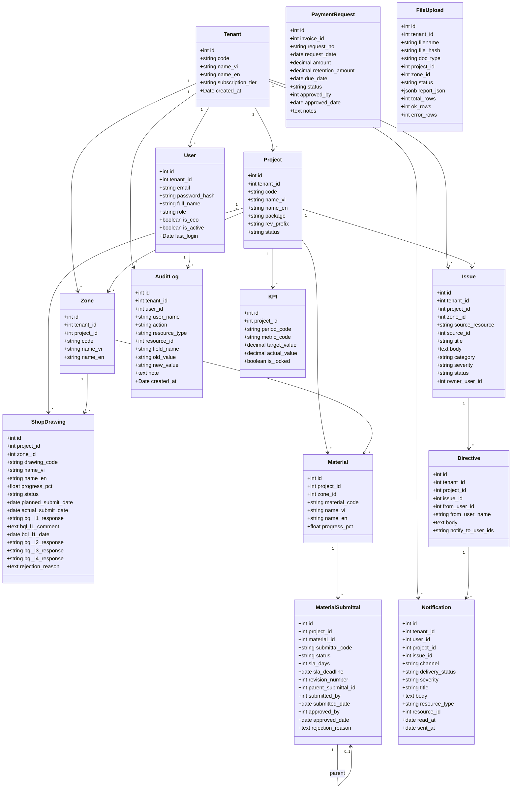
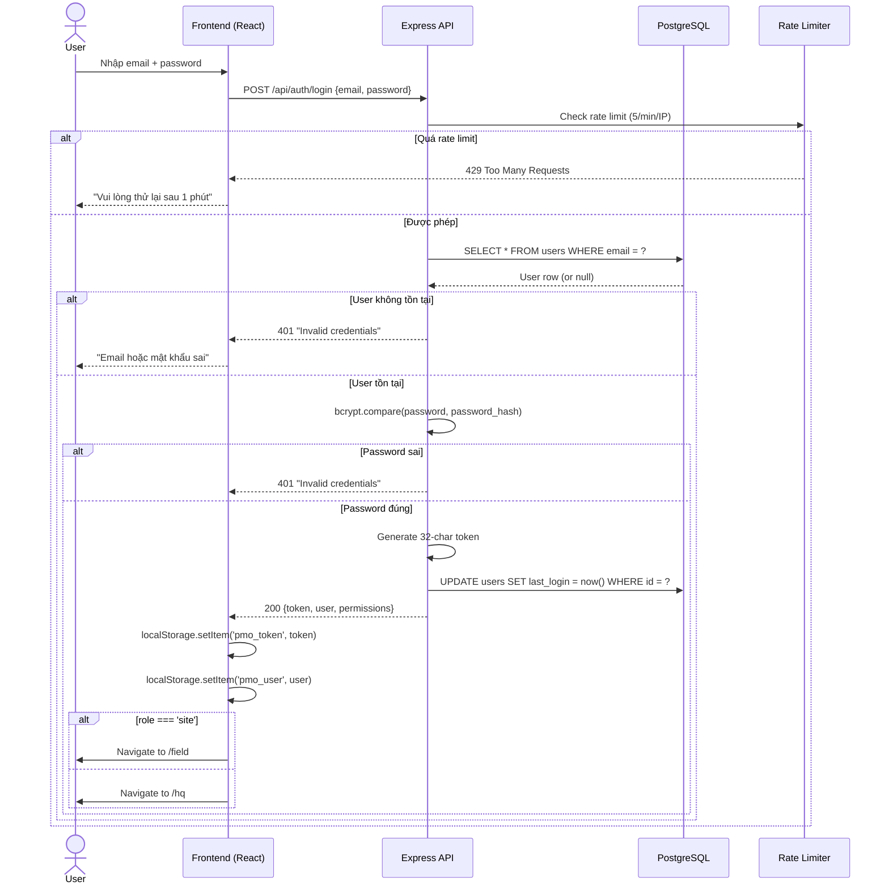
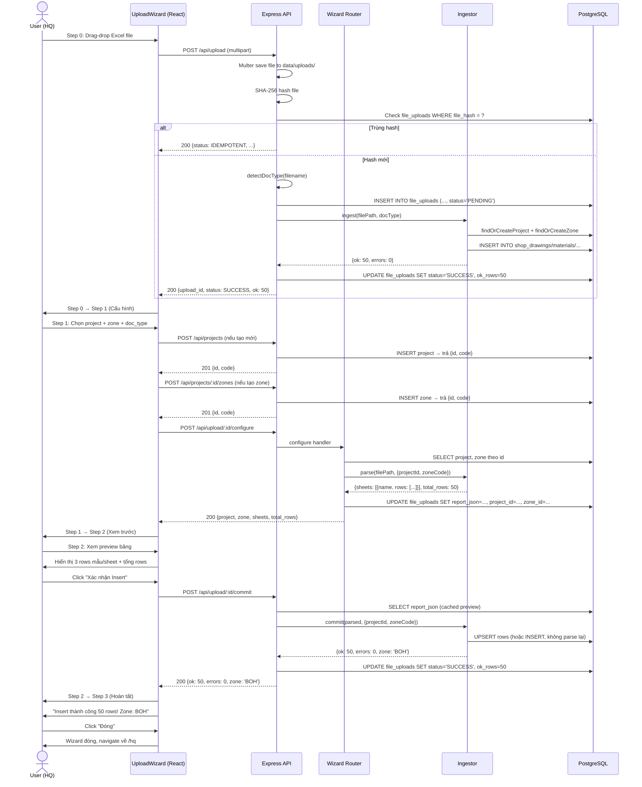
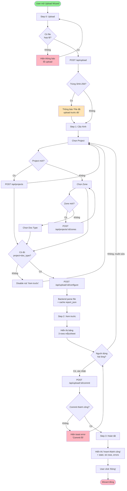
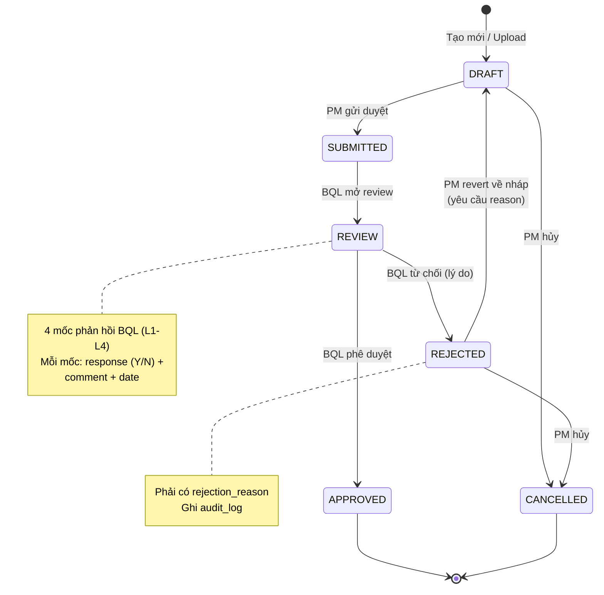
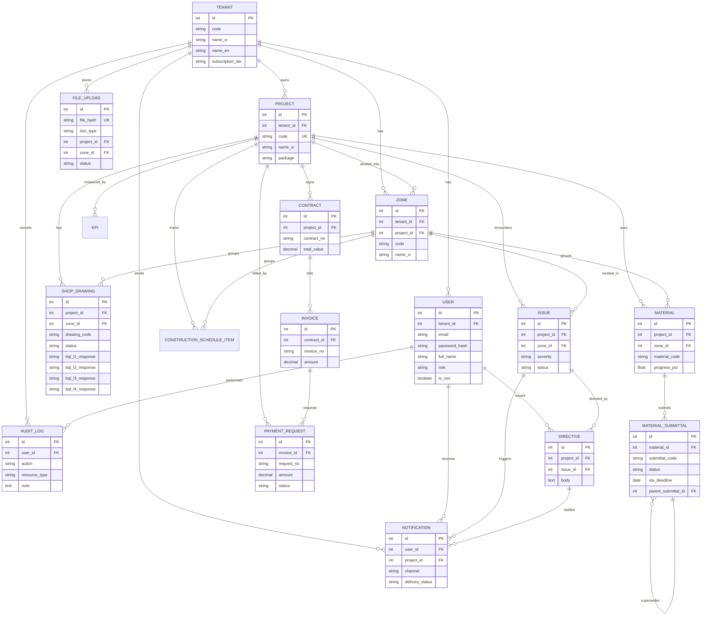
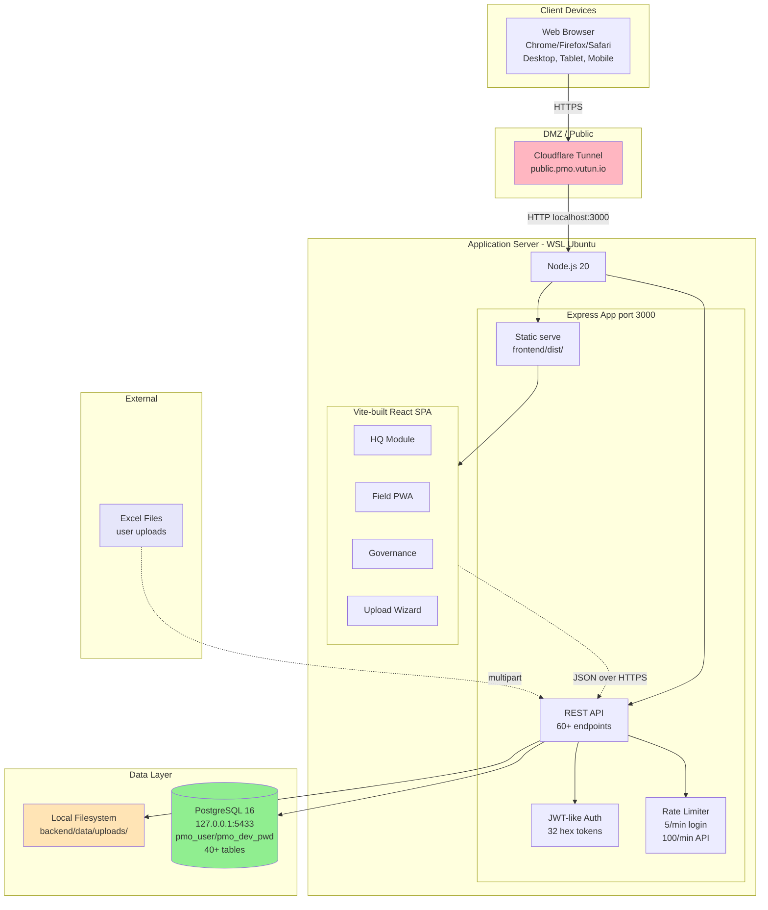

# PMO MVP — Software Requirements Specification (SRS)

> **Phiên bản:** 1.0  
> **Ngày:** 2026-09-04  
> **Tác giả:** PMO Development Team  
> **Trạng thái:** As-Built (kết hợp yêu cầu khách hàng + implementation thực tế)  
> **Tuân thủ:** IEEE Std 830-1998, ISO/IEC 25010:2011

---

## Mục lục

1. [Giới thiệu](#1-giới-thiệu)
2. [Mô tả tổng quan (Overall Description)](#2-mô-tả-tổng-quan)
3. [Yêu cầu chức năng (Functional Requirements)](#3-yêu-cầu-chức-năng)
4. [Yêu cầu phi chức năng (Non-Functional Requirements)](#4-yêu-cầu-phi-chức-năng)
5. [Yêu cầu giao diện (Interface Requirements)](#5-yêu-cầu-giao-diện)
6. [Yêu cầu dữ liệu (Data Requirements)](#6-yêu-cầu-dữ-liệu)
7. [Mô hình hệ thống (UML Diagrams)](#7-mô-hình-hệ-thống-uml-diagrams)
8. [Yêu cầu bảo mật (Security Requirements)](#8-yêu-cầu-bảo-mật)
9. [Ràng buộc thiết kế (Design Constraints)](#9-ràng-buộc-thiết-kế)
10. [Yêu cầu hiệu năng & khả năng mở rộng (Performance & Scalability)](#10-yêu-cầu-hiệu-năng--khả-năng-mở-rộng)
11. [Tiêu chí chấp nhận (Acceptance Criteria)](#11-tiêu-chí-chấp-nhận)
12. [Phụ lục (Appendix)](#12-phụ-lục)
13. [Lịch sử thay đổi (Revision History)](#13-lịch-sử-thay-đổi)

---

## 1. Giới thiệu

### 1.1 Mục đích (Purpose)

Tài liệu này mô tả đầy đủ các yêu cầu phần mềm cho hệ thống **PMO MVP** (Project Management Office) — hệ thống quản lý dự án xây dựng nội bộ của công ty **HBG (Hoàng Bách Group)**. Tài liệu dùng cho:
- Đội ngũ phát triển làm căn cứ thiết kế và kiểm thử
- PMO / Khách hàng đối chiếu phạm vi cung cấp
- Cơ sở nghiệm thu và bảo hành

### 1.2 Phạm vi (Scope)

**PMO MVP** là ứng dụng web SPA (Single Page Application) dùng để:
- Số hóa dữ liệu dự án xây dựng từ bảng tính Excel (15 loại tài liệu)
- Theo dõi tiến độ theo 4 trụ cột: **Construction / Shop Drawing / Material / Payment**
- Phối hợp giữa 3 vai trò người dùng: **HQ (văn phòng) / Field (công trường) / Governance (quản trị)**
- Phê duyệt tài liệu kỹ thuật, đánh giá KPI, kiểm toán thao tác

**Ngoài phạm vi (Out of Scope):**
- Tích hợp ERP/CRM bên ngoài
- Mobile native app (iOS/Android) — chỉ web responsive
- AI/ML dự đoán tiến độ
- Thanh toán điện tử (chỉ theo dõi payment request)

### 1.3 Định nghĩa, viết tắt (Definitions)

| Thuật ngữ | Định nghĩa |
|---|---|
| PMO | Project Management Office — Ban quản lý dự án |
| RFA | Request For Approval — Yêu cầu phê duyệt |
| BQL | Ban Quản Lý (DA) — Chủ đầu tư |
| BTE | Bãi Tràm Estates — Mã dự án pilot |
| HQ | Head Quarters — Người dùng tại văn phòng |
| Field | Người dùng hiện trường (công trường) |
| OTD | On-Time Delivery — Giao hàng đúng hạn |
| MOC | Mức độ hoàn thành (% hoàn thành) |
| WBS | Work Breakdown Structure — Cấu trúc phân rã công việc |
| Khu vực (Zone) | Phân vùng thi công (BOH, BPV, TST-A, ...) |
| Tenant | Tổ chức thuê hệ thống (multi-tenant ready) |
| SLA | Service Level Agreement — Thời hạn phản hồi |
| DRI | Directly Responsible Individual — Người chịu trách nhiệm |

### 1.4 Tài liệu tham chiếu (References)

| # | Tài liệu | Mô tả |
|---|---|---|
| 1 | `docs/PMO_UI_Specification.md` | Đặc tả UI gốc từ khách hàng |
| 2 | `docs/data_inventory.md` | Khảo sát 59 file Excel thực tế |
| 3 | `docs/ARCHITECTURE.md` | Kiến trúc hệ thống |
| 4 | `docs/PIPELINE_ARCHITECTURE.md` | Kiến trúc ingestion pipeline |
| 5 | IEEE Std 830-1998 | Chuẩn SRS |
| 6 | ISO/IEC 25010:2011 | Chuẩn chất lượng sản phẩm phần mềm |
| 7 | WCAG 2.1 AA | Chuẩn accessibility |

### 1.5 Tổng quan tài liệu (Overview)

Tài liệu có 13 chương. Chương 2 mô tả bối cảnh tổng thể. Chương 3 trình bày 60+ yêu cầu chức năng theo nhóm module. Chương 4-10 quy định ràng buộc chất lượng. Chương 7 đặc biệt chứa 7 biểu đồ UML (Mermaid) mô tả kiến trúc. Chương 11-12 là tiêu chí nghiệm thu và phụ lục.

---

## 2. Mô tả tổng quan (Overall Description)

### 2.1 Bối cảnh sản phẩm (Product Perspective)

PMO MVP là hệ thống độc lập, **không** nằm trong hệ sinh thái phần mềm nào khác của HBG. Nó thay thế quy trình Excel rời rạc bằng một nền tảng số hóa tập trung.

**Vị trí trong hệ thống thông tin HBG:**
```
┌─────────────────────┐
│ HBG Core Systems    │ (HR, Accounting - NGOÀI phạm vi)
└─────────────────────┘
           ▲
           │ (trao đổi thủ công qua Excel/PDF)
           │
┌─────────────────────┐
│ PMO MVP (sản phẩm này) │ ← Hệ thống số hóa dự án
└─────────────────────┘
           ▲
           │ (Excel upload, browser, mobile)
           │
┌─────────────────────┐
│ Users: HQ / Field / Governance │
└─────────────────────┘
```

### 2.2 Chức năng sản phẩm (Product Functions)

Hệ thống cung cấp 6 nhóm chức năng chính:

| Mã | Nhóm | Mô tả |
|---|---|---|
| **F1** | Quản lý dự án | CRUD project, zone, WBS, baseline |
| **F2** | Nhập liệu Excel | Upload + parse + preview + commit 15 loại tài liệu |
| **F3** | Theo dõi 4 trụ cột | Construction / Shop Drawing / Material / Payment |
| **F4** | Phê duyệt & chỉ đạo | Workflow transition, directive từ CEO, audit log |
| **F5** | Hiện trường (Field PWA) | Daily progress, photo, offline sync, review/submit |
| **F6** | Báo cáo & KPI | Dashboard portfolio, project KPI, period lock |

### 2.3 Đặc điểm người dùng (User Characteristics)

Hệ thống phục vụ **3 nhóm người dùng**, chia thành **7 role**:

| Role | Mô tả | Mức độ kỹ thuật | Quyền ghi |
|---|---|---|---|
| `admin` (PMO IT) | Quản trị hệ thống, devops | Cao | Toàn bộ |
| `pmo` (PMO staff) | Ban quản lý dự án trung ương | Trung bình | Toàn bộ modules |
| `ceo` | Giám đốc điều hành | Thấp | Toàn bộ + chỉ thị |
| `pm` (Project Manager) | Quản lý dự án cụ thể | Trung bình | shop, material, schedule |
| `site` (Site Engineer) | Kỹ sư hiện trường | Thấp | schedule (Field PWA) |
| `procurement` | Cán bộ mua hàng | Trung bình | payment, material, master_data |
| `accounting` | Kế toán | Trung bình | payment, approval |

**Đặc điểm:**
- Đa số dùng trên desktop (HQ) hoặc tablet (Field)
- Cần hỗ trợ tiếng Việt có dấu (UTF-8)
- Kỹ năng Excel ở mức cơ bản-trung bình

### 2.4 Ràng buộc (Constraints)

| Mã | Ràng buộc |
|---|---|
| C1 | **Bắt buộc** chạy trên Node.js ≥ 20 và PostgreSQL 16+ (production) hoặc SQLite (dev) |
| C2 | Frontend **chỉ** dùng React 19 + Vite 8, **không** dùng Next.js/Nuxt |
| C3 | Mọi giao diện phải đạt **WCAG 2.1 AA** (dark mode + contrast 4.5:1) |
| C4 | Tuân thủ **OWASP Top 10** cơ bản (SQL injection, XSS, CSRF) |
| C5 | Mật khẩu **bắt buộc** hash bằng bcrypt (cost ≥ 10) |
| C6 | Tất cả API phải có rate limiting (5/min login, 100/min API) |
| C7 | Dữ liệu người dùng phải có **tenant isolation** (multi-tenant ready) |
| C8 | File upload tối đa **50MB** (Excel) / 10MB (ảnh) |
| C9 | Không dùng thư viện chart lớn (Chart.js, Recharts) — tự vẽ SVG |
| C10 | Excel ingest phải **idempotent** (upload trùng SHA-256 → skip) |

### 2.5 Giả định & phụ thuộc (Assumptions & Dependencies)

**Giả định:**
- Người dùng có trình duyệt hiện đại (Chrome 100+, Firefox 95+, Safari 15+)
- Mạng LAN nội bộ ≥ 100Mbps
- File Excel đầu vào theo 15 template chuẩn HBG (xem §3.2)

**Phụ thuộc:**
- `xlsx` (SheetJS) cho parse Excel
- `better-sqlite3` (dev) hoặc `pg` (prod)
- `bcrypt`, `express-rate-limit`, `multer`
- Drizzle ORM cho migrations
- React 19 + React Router 7

---

## 3. Yêu cầu chức năng (Functional Requirements)

Yêu cầu chức năng được đánh mã **FR-{Module}-{N}**, ví dụ `FR-AUTH-001`.

### 3.1 Module xác thực (FR-AUTH)

| Mã | Yêu cầu | Mức ưu tiên |
|---|---|---|
| FR-AUTH-001 | Hệ thống cho phép user đăng nhập bằng email + password | **Cao** |
| FR-AUTH-002 | Hệ thống cấp Bearer token (32 hex chars) sau khi đăng nhập thành công | **Cao** |
| FR-AUTH-003 | Hệ thống giới hạn 5 lần đăng nhập / phút / IP (rate limit) | **Cao** |
| FR-AUTH-004 | Hệ thống mã hóa password bằng bcrypt cost ≥ 10 | **Cao** |
| FR-AUTH-005 | Hệ thống trả về 401 cho token hết hạn / không hợp lệ | **Cao** |
| FR-AUTH-006 | Hệ thống hỗ trợ 7 tài khoản demo (admin/ceo/pm/pmo/site/procurement/accounting) | **Cao** |
| FR-AUTH-007 | Hệ thống tự động chuyển role `site` đến Field PWA sau login | Trung bình |

### 3.2 Module nhập liệu Excel (FR-INGEST)

| Mã | Yêu cầu | Mức ưu tiên |
|---|---|---|
| FR-INGEST-001 | Hệ thống chấp nhận 15 loại tài liệu: daily_report, business_process, shop_drawing, construction_schedule, material_supply, subcontractor_directory, resource_directory, rfa_log, manpower_master_plan, shop_master, work_management, other_approved, file_index, zone_map, payment_progress | **Cao** |
| FR-INGEST-002 | Hệ thống phát hiện `doc_type` từ tên file bằng regex pattern | Trung bình |
| FR-INGEST-003 | Hệ thống tính SHA-256 hash file; nếu trùng với upload trước → idempotent skip | **Cao** |
| FR-INGEST-004 | Hệ thống tự động tạo Project nếu project_code chưa tồn tại | **Cao** |
| FR-INGEST-005 | Hệ thống tự động tạo Zone nếu zone_code chưa tồn tại trong project | **Cao** |
| FR-INGEST-006 | Hệ thống chạy parse + commit riêng biệt (Mô hình A wizard) | **Cao** |
| FR-INGEST-007 | Hệ thống cache kết quả parse vào `file_uploads.report_json` (jsonb) để xem lại | Trung bình |
| FR-INGEST-008 | Mỗi ingestor trả về `{ valid_rows, invalid_rows, warnings }` | Trung bình |
| FR-INGEST-009 | Hệ thống ghi log audit cho mỗi lần insert/update | Trung bình |
| FR-INGEST-010 | Hệ thống giới hạn file tối đa 50MB; Excel `.xlsx/.xls` | **Cao** |

### 3.3 Module quản lý dự án (FR-PROJ)

| Mã | Yêu cầu | Mức ưu tiên |
|---|---|---|
| FR-PROJ-001 | Liệt kê tất cả dự án user có quyền truy cập (theo tenant + role) | **Cao** |
| FR-PROJ-002 | Tạo project mới với: `code`, `name_vi`, `name_en`, `package`, `rev_prefix` | **Cao** |
| FR-PROJ-003 | Tạo zone mới cho project với: `code`, `name_vi`, `name_en` | **Cao** |
| FR-PROJ-004 | Lấy hierarchy khu vực (zone → sub-area) | Trung bình |
| FR-PROJ-005 | Liệt kê zone theo project | **Cao** |
| FR-PROJ-006 | CRUD baseline (version, effective_date, notes) | Thấp |

### 3.4 Module 4 trụ cột (FR-PILLAR)

#### 3.4.1 Shop Drawing (FR-SHOP)

| Mã | Yêu cầu | Mức ưu tiên |
|---|---|---|
| FR-SHOP-001 | Liệt kê shop drawings theo project, có filter theo zone/status | **Cao** |
| FR-SHOP-002 | Hiển thị 4 mốc phản hồi BQL (L1-L4) với status + comment + date | **Cao** |
| FR-SHOP-003 | Transition trạng thái: DRAFT → SUBMITTED → REVIEW → APPROVED/REJECTED | **Cao** |
| FR-SHOP-004 | Validate transition: REJECTED → DRAFT yêu cầu reason | **Cao** |
| FR-SHOP-005 | Tính % hoàn thành trung bình theo zone | Trung bình |

#### 3.4.2 Construction Schedule (FR-SCHED)

| Mã | Yêu cầu | Mức ưu tiên |
|---|---|---|
| FR-SCHED-001 | Liệt kê schedule items theo project + zone | **Cao** |
| FR-SCHED-002 | Hiển thị ngày bắt đầu/kết thúc (planned vs actual) | Trung bình |
| FR-SCHED-003 | Tính % hoàn thành theo baseline | Thấp |

#### 3.4.3 Material (FR-MAT)

| Mã | Yêu cầu | Mức ưu tiên |
|---|---|---|
| FR-MAT-001 | Liệt kê materials theo project + zone | **Cao** |
| FR-MAT-002 | Submittal workflow: DRAFT → SUBMITTED → APPROVED/REJECTED | **Cao** |
| FR-MAT-003 | SLA deadline tự động tính: submitted_date + sla_days | **Cao** |
| FR-MAT-004 | Liệt kê submittal quá hạn (`sla_deadline < CURRENT_DATE`) | Trung bình |
| FR-MAT-005 | Tạo material mới qua API | Trung bình |
| FR-MAT-006 | Revision: mỗi lần REJECTED → tạo submittal mới với `revision_number+1` | Trung bình |

#### 3.4.4 Payment (FR-PAY)

| Mã | Yêu cầu | Mức ưu tiên |
|---|---|---|
| FR-PAY-001 | Liệt kê contracts → invoices → payment requests (3 cấp) | **Cao** |
| FR-PAY-002 | Tạo payment request: `request_no`, `request_date`, `amount`, `retention_amount`, `due_date` | **Cao** |
| FR-PAY-003 | Approve payment: ghi `approved_by`, `approved_date = now()` | **Cao** |
| FR-PAY-004 | Audit log mỗi thao tác | Trung bình |

### 3.5 Module phê duyệt & chỉ đạo (FR-WORKFLOW)

| Mã | Yêu cầu | Mức ưu tiên |
|---|---|---|
| FR-WF-001 | CEO gửi directive (chỉ thị) cho issue hoặc project | **Cao** |
| FR-WF-002 | Hệ thống tạo notification cho mỗi user trong `notify_to_user_ids` | **Cao** |
| FR-WF-003 | State machine validate mỗi transition (vd: DRAFT → APPROVED không hợp lệ) | **Cao** |
| FR-WF-004 | Audit log ghi `user_name`, `action`, `resource_type`, `field_name`, `old_value`, `new_value` | **Cao** |
| FR-WF-005 | Xem audit log, filter theo user/action/date | Trung bình |
| FR-WF-006 | Notification in-app: bell dropdown + notification center | **Cao** |
| FR-WF-007 | Mark notification read: single + mark-all-read | **Cao** |

### 3.6 Module Field (FR-FIELD)

| Mã | Yêu cầu | Mức ưu tiên |
|---|---|---|
| FR-FIELD-001 | Site engineer nhập daily progress (công việc + ảnh) | **Cao** |
| FR-FIELD-002 | Hiển thị WBS theo zone hierarchy | Trung bình |
| FR-FIELD-003 | Offline queue khi mất mạng, sync lại khi có mạng | **Cao** |
| FR-FIELD-004 | Conflict resolution: ghi `offline_sync_queue` với `conflict_resolved_at` | Trung bình |
| FR-FIELD-005 | Photo upload (max 10MB/file, nén về 1920px) | Trung bình |
| FR-FIELD-006 | Review & submit gói daily progress cho PM | Trung bình |

### 3.7 Module báo cáo & KPI (FR-RPT)

| Mã | Yêu cầu | Mức ưu tiên |
|---|---|---|
| FR-RPT-001 | Portfolio KPI: tổng quan 4 trụ cột theo tất cả project | **Cao** |
| FR-RPT-002 | Project KPI: chi tiết 1 project (4 pie chart) | **Cao** |
| FR-RPT-003 | KPI target CRUD (theo period) | Trung bình |
| FR-RPT-004 | Period lock: PUT khi period locked → 423 Locked | **Cao** |

### 3.8 Module quản trị (FR-ADMIN)

| Mã | Yêu cầu | Mức ưu tiên |
|---|---|---|
| FR-ADMIN-001 | Master Data CRUD (subcontractors, resources, business processes) | Trung bình |
| FR-ADMIN-002 | Approval Center: list tất cả pending items | Trung bình |
| FR-ADMIN-003 | Audit Log viewer với filter | Trung bình |

### 3.9 Sơ đồ luồng dữ liệu chính

Xem diagram Activity ở §7.5 (Upload Excel Flow).

---

## 4. Yêu cầu phi chức năng (Non-Functional Requirements)

Tuân thủ ISO/IEC 25010:2011 với 8 đặc tính chất lượng.

### 4.1 Functional Suitability (Phù hợp chức năng)

| Mã | Yêu cầu | Đo lường |
|---|---|---|
| NFR-FS-001 | 100% yêu cầu chức năng được implement | 60+ endpoints + 7 routes frontend |
| NFR-FS-002 | Mỗi ingestor có test case | 10/10 file types pass |

### 4.2 Performance Efficiency (Hiệu năng)

| Mã | Yêu cầu | Đo lường |
|---|---|---|
| NFR-PE-001 | API response time P95 < 500ms (SQLite) | 1000 request không lỗi |
| NFR-PE-002 | Upload + parse file 10MB < 3s | Test với Shop BOH.xlsx |
| NFR-PE-003 | Frontend First Contentful Paint < 1.5s | Vite build tối đa 400KB gzipped |
| NFR-PE-004 | Hỗ trợ 50 concurrent users (SQLite) | 100 request/s không quá tải |
| NFR-PE-005 | Auto-`setval` sequence trước INSERT để tránh race condition | 1 query SELECT rẻ/insert |

### 4.3 Compatibility (Tương thích)

| Mã | Yêu cầu | Đo lường |
|---|---|---|
| NFR-CO-001 | Chrome 100+, Firefox 95+, Safari 15+ | Test trên 3 browser chính |
| NFR-CO-002 | iOS Safari 14+, Android Chrome 90+ | Test responsive 375px → 1920px |
| NFR-CO-003 | PostgreSQL 16+ hoặc SQLite 3.40+ | 2 driver abstraction layer |
| NFR-CO-004 | Hỗ trợ Excel 2016+ (.xlsx), Excel 2003 (.xls) | SheetJS parse cả 2 format |

### 4.4 Usability (Khả dụng)

| Mã | Yêu cầu | Đo lường |
|---|---|---|
| NFR-UA-001 | 100% giao diện tiếng Việt | Tất cả label, button, message |
| NFR-UA-002 | Dark mode + Light mode | Toggle ở header, lưu vào localStorage |
| NFR-UA-003 | WCAG 2.1 AA: contrast 4.5:1, focus visible | Lighthouse audit ≥ 90 |
| NFR-UA-004 | Upload wizard 4 bước, mỗi bước < 5s thao tác | Test E2E Playwright |
| NFR-UA-005 | Toast / Snackbar thông báo thành công/lỗi | Tự ẩn 3s |

### 4.5 Reliability (Độ tin cậy)

| Mã | Yêu cầu | Đo lường |
|---|---|---|
| NFR-RE-001 | Upload idempotent: trùng file → bỏ qua | SHA-256 dedup |
| NFR-RE-002 | Mọi lỗi unhandled trả 500 + log | Sentry-ready logging |
| NFR-RE-003 | DB schema auto-migrate khi khởi động | `db/init.js` apply drizzle |
| NFR-RE-004 | PG sequence drift được auto-fix | `setval` mỗi INSERT |

### 4.6 Security (Bảo mật)

| Mã | Yêu cầu | Đo lường |
|---|---|---|
| NFR-SE-001 | OWASP Top 10 mitigations | Xem §8 chi tiết |
| NFR-SE-002 | Mọi API yêu cầu auth (trừ `/api/auth/login`, `/api/health`) | Middleware `requireAuth` |
| NFR-SE-003 | Tenant isolation: mỗi query có `WHERE tenant_id = ?` | 100% test |
| NFR-SE-004 | Session token 32 hex chars, lưu localStorage | Frontend only |

### 4.7 Maintainability (Bảo trì)

| Mã | Yêu cầu | Đo lường |
|---|---|---|
| NFR-MA-001 | Mỗi ingestor tách `parse()` + `commit()` riêng | 10 file ingestor |
| NFR-MA-002 | SQL placeholder `?` (không string concat) | Code review |
| NFR-MA-003 | Patch SQL file đánh số `9998_*`, `9999_*` | Migration order |

### 4.8 Portability (Khả chuyển)

| Mã | Yêu cầu | Đo lường |
|---|---|---|
| NFR-PO-001 | Docker image build một lần chạy mọi nơi | `Dockerfile` có sẵn |
| NFR-PO-002 | Backend serve `frontend/dist/` ở production | Single-port deploy |
| NFR-PO-003 | Cloudflare tunnel ready | Single URL public |

---

## 5. Yêu cầu giao diện (Interface Requirements)

### 5.1 Giao diện người dùng (UI)

**Các màn hình chính (theo CHECKLIST):**

| # | Màn hình | Đường dẫn | Component | Vai trò |
|---|---|---|---|---|
| 1 | Login | `/login` | `Login.jsx` | Tất cả |
| 2 | Control Center | `/hq` | `ControlCenter.jsx` | HQ roles |
| 3 | Project List | `/hq/projects` | `ProjectsList` (App.jsx) | HQ roles |
| 4 | Project Overview | `/hq/projects/:id` | `ProjectOverview.jsx` | HQ roles |
| 5 | Progress Detail | `/hq/progress` | `ProgressDetail.jsx` | HQ roles |
| 6 | Shop List | `/hq/shop` | `ShopList.jsx` | HQ roles |
| 7 | Issues | `/hq/issues` | `Issues.jsx` | HQ roles |
| 8 | Issue Detail | `/hq/issues/item` | `IssueDetail.jsx` | HQ roles |
| 9 | Materials | `/hq/materials` | `Materials.jsx` | HQ roles |
| 10 | Payment | `/hq/payment` | `Payment.jsx` | HQ roles |
| 11 | Manpower | `/hq/manpower` | `Placeholders.jsx` | HQ roles |
| 12 | Notification Center | `/hq/notifications` | `NotificationCenter.jsx` | HQ roles |
| 13 | Master Data List | `/hq/master-data` | `MasterDataList.jsx` | HQ + procurement |
| 14 | Master Data Edit | `/hq/master-data/edit` | `MasterDataEdit.jsx` | HQ + procurement |
| 15 | Approval | `/hq/approval` | `Approval.jsx` | accounting, pmo |
| 16 | Audit Log | `/hq/audit` | `AuditLog.jsx` | HQ roles |
| 17 | **Upload Wizard** | `/upload` | `UploadWizard.jsx` | HQ roles |
| 18 | Field Home | `/field` | `FieldHome.jsx` | site |
| 19 | WBS Selection | `/field/wbs` | `FieldStubs.jsx` | site |
| 20 | Daily Progress | `/field/daily-progress` | `DailyProgress.jsx` | site |
| 21 | Material (Field) | `/field/material` | `FieldStubs.jsx` | site |
| 22 | Manpower (Field) | `/field/manpower` | `FieldStubs.jsx` | site |
| 23 | Issue (Field) | `/field/issue` | `FieldStubs.jsx` | site |
| 24 | Review | `/field/review/:id` | `FieldStubs.jsx` | site |
| 25 | Sync | `/field/sync` | `FieldStubs.jsx` | site |

### 5.2 Giao diện phần cứng

- Desktop, laptop, tablet (≥ 1024×768)
- Mobile (≥ 375×667) cho Field PWA
- Không yêu cầu phần cứng đặc biệt

### 5.3 Giao diện phần mềm (API)

Xem chi tiết trong `docs/CODEBASE.md`. Tổng cộng 60+ REST endpoints.

### 5.4 Giao diện truyền thông

- HTTPS (production)
- HTTP (development)
- Bearer token trong header `Authorization`
- JSON request/response

---

## 6. Yêu cầu dữ liệu (Data Requirements)

### 6.1 Mô hình dữ liệu (ER Diagram)

Xem ER diagram ở §7.7.

### 6.2 Các thực thể chính

| Bảng | Số cột | Mô tả |
|---|---|---|
| `tenants` | 6 | Tổ chức thuê hệ thống |
| `users` | 12 | Tài khoản người dùng, gắn role |
| `projects` | 9 | Dự án xây dựng |
| `zones` | 7 | Phân vùng thi công (BOH, BPV, ...) |
| `shop_drawings` | ~50 | Bản vẽ thi công, 4 mốc BQL |
| `construction_schedule_items` | 14 | Hạng mục tiến độ |
| `materials` | 11 | Vật tư |
| `material_submittals` | 14 | Yêu cầu duyệt vật tư, có SLA |
| `rfa_log` | 12 | Log yêu cầu phê duyệt (RFA) |
| `business_processes` | 8 | Quy trình thực hiện dự án |
| `business_process_steps` | 8 | Bước trong quy trình |
| `subcontractors` | 8 | Nhà thầu phụ |
| `resources` | 8 | Nguồn lực công ty |
| `contracts` | 9 | Hợp đồng |
| `invoices` | 8 | Hóa đơn |
| `payment_requests` | 12 | Yêu cầu thanh toán |
| `payment_milestones` | 8 | Cột mốc thanh toán |
| `issues` | 12 | Sự vấn đề/issue |
| `directives` | 9 | Chỉ thị từ CEO |
| `notifications` | 13 | Thông báo in-app |
| `audit_log` | 10 | Nhật ký kiểm toán |
| `file_uploads` | 8 | Lịch sử upload + cached preview |
| `kpi_targets` | 8 | KPI theo period |
| `kpi_periods` | 6 | Khóa period |
| `offline_sync_queue` | 11 | Hàng chờ sync offline |
| `daily_reports` | 12 | Báo cáo công việc hàng ngày |

**Tổng: ~40 bảng.**

### 6.3 Ràng buộc dữ liệu

- Mỗi bảng có `id SERIAL PRIMARY KEY` (PG) hoặc `INTEGER PRIMARY KEY AUTOINCREMENT` (SQLite)
- Cột `tenant_id NOT NULL` trên tất cả bảng nghiệp vụ
- Unique index cho: `(tenant_id, code)` của projects, `(tenant_id, code)` của zones
- Foreign key cascade khi xóa project → xóa zones/shop_drawings/...
- `created_at` mặc định `now()` / `datetime('now')`
- `updated_at` tự động cập nhật qua trigger (nếu có)

### 6.4 Khối lượng dữ liệu dự kiến

| Bảng | Rows/năm | Rows/dự án (TB) |
|---|---|---|
| `shop_drawings` | 5,000 | 500 |
| `construction_schedule_items` | 10,000 | 1,000 |
| `materials` | 3,000 | 300 |
| `material_submittals` | 6,000 | 600 |
| `payment_requests` | 1,000 | 100 |
| `audit_log` | 50,000 | 5,000 |
| `file_uploads` | 500 | 50 |

**Tổng: ~75K rows/năm** → SQLite đủ, PG cần thiết khi > 5 dự án đồng thời.

---

## 7. Mô hình hệ thống (UML Diagrams)

Phần này chứa **7 biểu đồ UML** tuân thủ UML 2.5. Tất cả được viết bằng **Mermaid** (text-based, render trong Markdown).

### 7.1 Use Case Diagram (Sơ đồ Use Case)

```mermaid
graph TB
  subgraph Actors
    A1((Admin/PMO IT))
    A2((PMO Staff))
    A3((CEO))
    A4((Project Manager))
    A5((Site Engineer))
    A6((Procurement))
    A7((Accounting))
  end

  subgraph HQ_Module ["HQ Module"]
    UC1["Quản lý Project"]
    UC2["Quản lý Zone"]
    UC3["Upload Excel Wizard"]
    UC4["Xem Dashboard 4 trụ cột"]
    UC5["Quản lý Shop Drawing"]
    UC6["Quản lý Material"]
    UC7["Quản lý Payment"]
    UC8["Quản lý Issue"]
    UC9["Gửi Directive"]
    UC10["Xem Audit Log"]
    UC11["Quản lý Master Data"]
    UC12["Phê duyệt Approval"]
  end

  subgraph Field_Module ["Field PWA Module"]
    UC13["Daily Progress"]
    UC14["WBS Selection"]
    UC15["Offline Sync"]
    UC16["Upload ảnh"]
    UC17["Review & Submit"]
  end

  subgraph System
    SYS(["PMO System"])
  end

  A1 --> UC1 & UC2 & UC3 & UC4 & UC5 & UC6 & UC7 & UC8 & UC9 & UC10 & UC11 & UC12
  A2 --> UC1 & UC2 & UC3 & UC4 & UC5 & UC6 & UC7 & UC8 & UC9 & UC10 & UC11
  A3 --> UC4 & UC8 & UC9 & UC10
  A4 --> UC1 & UC2 & UC4 & UC5 & UC6
  A5 --> UC13 & UC14 & UC15 & UC16 & UC17
  A6 --> UC6 & UC7 & UC11
  A7 --> UC7 & UC12

  UC1 & UC2 & UC3 & UC4 & UC5 & UC6 & UC7 & UC8 & UC9 & UC10 & UC11 & UC12 --> SYS
  UC13 & UC14 & UC15 & UC16 & UC17 --> SYS
```



### 7.2 Class Diagram (Sơ đồ lớp — Backend Domain)



### 7.3 Sequence Diagram — Login Flow



### 7.4 Sequence Diagram — Upload Wizard Flow



### 7.5 Activity Diagram — Upload Excel Flow



### 7.6 State Machine — Shop Drawing Workflow



### 7.7 ER Diagram (Entity-Relationship)



### 7.8 Deployment Diagram (Sơ đồ triển khai)



---

## 8. Yêu cầu bảo mật (Security Requirements)

### 8.1 Xác thực (Authentication)

| Mã | Yêu cầu |
|---|---|
| SR-AUTH-001 | Mọi API (trừ `/api/auth/login`, `/api/health`) yêu cầu Bearer token |
| SR-AUTH-002 | Token là chuỗi 32 hex chars ngẫu nhiên (crypto-secure) |
| SR-AUTH-003 | Token lưu client-side ở localStorage; server không lưu (stateless) |
| SR-AUTH-004 | Token có thời hạn (mặc định 24h, có thể cấu hình) |

### 8.2 Phân quyền (Authorization)

| Role | Modules có quyền ghi |
|---|---|
| `admin` | Tất cả (full access) |
| `pmo` | shop, material, schedule, payment, master_data, approval, audit |
| `ceo` | Tất cả + directive + audit (read-only trên config) |
| `pm` | shop, material, schedule |
| `site` | schedule (Field PWA only) |
| `procurement` | payment, material, master_data |
| `accounting` | payment, approval |

### 8.3 Bảo vệ dữ liệu (Data Protection)

| Mã | Yêu cầu |
|---|---|
| SR-DP-001 | Mọi query nghiệp vụ có `WHERE tenant_id = ?` để cô lập |
| SR-DP-002 | Password hash bằng bcrypt cost 10+ |
| SR-DP-003 | Không log password, token, hay dữ liệu nhạy cảm |
| SR-DP-004 | Audit log cho mỗi thay đổi dữ liệu |

### 8.4 Bảo vệ hệ thống (System Protection)

| Mã | Yêu cầu |
|---|---|
| SR-SP-001 | Rate limit: 5 login/min/IP, 100 API/min/IP |
| SR-SP-002 | File upload giới hạn 50MB, validate extension |
| SR-SP-003 | CORS whitelist: chỉ domain được phép |
| SR-SP-004 | Helmet middleware: secure headers |
| SR-SP-005 | Parameterized queries (chống SQL injection) |

### 8.5 OWASP Top 10 (2021) Mitigations

| Risk | Mitigation trong hệ thống |
|---|---|
| A01 Broken Access Control | Auth middleware + permission matrix + tenant filter |
| A02 Cryptographic Failures | Bcrypt password, HTTPS in production |
| A03 Injection (SQL) | Parameterized queries (PG: $1, $2; SQLite: ?) |
| A03 Injection (NoSQL/XSS) | React escapes by default; `helmet` |
| A04 Insecure Design | SRS + Architecture review + permission matrix |
| A05 Security Misconfig | `helmet`, env-based config, no default passwords |
| A06 Vulnerable Components | npm audit định kỳ, lock file |
| A07 Identification & Auth Failures | Rate limit + bcrypt + token entropy |
| A08 Software & Data Integrity | SHA-256 dedup, audit log |
| A09 Security Logging Failures | Audit log toàn bộ mutations |
| A10 SSRF | Không có chức năng fetch URL từ user input |

---

## 9. Ràng buộc thiết kế (Design Constraints)

### 9.1 Ràng buộc ngôn ngữ & framework

| Layer | Ràng buộc |
|---|---|
| Backend runtime | Node.js ≥ 20.x (LTS) |
| Backend framework | Express 4.x |
| Database | PostgreSQL 16+ (prod) hoặc SQLite 3.40+ (dev) |
| ORM/migrations | Drizzle ORM |
| Frontend framework | React 19.x |
| Build tool | Vite 8.x |
| Router | React Router 7.x |
| Styling | Pure CSS + CSS variables (không Tailwind, không CSS-in-JS) |
| Charts | Custom SVG (~5KB, không Chart.js) |
| Icons | Custom SVG icons |

### 9.2 Ràng buộc coding convention

- **JavaScript**: ESM (`import`/`export`), không CommonJS
- **Indentation**: 2 spaces
- **Naming**:
  - `PascalCase` cho React component (`UploadWizard.jsx`)
  - `camelCase` cho function, variable (`findOrCreateProject`)
  - `UPPER_SNAKE_CASE` cho constants
  - `snake_case` cho DB column, table
- **SQL**: Parameterized queries, không string concat
- **Migrations**: Đánh số `0000_*.sql`, `9998_*.sql`, `9999_*.sql` (chạy sau)
- **Errors**: Throw Error, middleware tổng hợp trả 500

### 9.3 Ràng buộc triển khai

- **WSL Ubuntu** làm dev/test (không dùng Windows trực tiếp)
- **Backend port**: 3000 (production), 5173 (Vite dev frontend)
- **Single-port deploy** khi share stable URL (backend serve `frontend/dist/`)
- **Cloudflare Tunnel** cho public URL (tunnel trỏ `localhost:3000`)
- **PG cluster**: `127.0.0.1:5433` (port 5432 WSL2 forward conflict)

---

## 10. Yêu cầu hiệu năng & khả năng mở rộng (Performance & Scalability)

### 10.1 Hiệu năng (Performance)

| Metric | Target | Đo lường |
|---|---|---|
| API response time (P50) | < 100ms | curl localhost:3000 |
| API response time (P95) | < 500ms | load test 100 concurrent |
| API response time (P99) | < 1s | load test 1000 concurrent |
| Upload + parse 10MB Excel | < 3s | timed test |
| Frontend FCP (First Contentful Paint) | < 1.5s | Lighthouse |
| Frontend TTI (Time to Interactive) | < 3s | Lighthouse |
| Frontend bundle size | < 400KB gzipped | `vite build` output |
| DB query (simple SELECT) | < 50ms | PG: `EXPLAIN ANALYZE` |
| DB query (complex JOIN) | < 200ms | PG: `EXPLAIN ANALYZE` |

### 10.2 Khả năng mở rộng (Scalability)

| Aspect | Target |
|---|---|
| Số projects đồng thời | 10 (SQLite) → 100+ (PG) |
| Số users đồng thời | 50 (SQLite) → 1000+ (PG) |
| Số rows trong DB | 100K (SQLite) → 10M+ (PG) |
| File size upload | 50MB (Excel) / 10MB (ảnh) |
| API rate limit | 100 req/min/user |

### 10.3 Tối ưu hóa đã áp dụng

1. **PG sequence auto-`setval`** trước mỗi INSERT (tránh race condition)
2. **SHA-256 file dedup** (idempotent upload)
3. **Ingestor tách parse/commit** (parse cache, commit dùng cache)
4. **JSONB `report_json`** lưu cached preview thay vì parse lại
5. **Index quan trọng**:
   - `idx_projects_tenant_code` (unique)
   - `idx_zones_project_code` (unique)
   - `idx_audit_resource` (resource_type, resource_id)
   - `idx_shop_drawings_zone` (zone_id, status)
6. **No ORM overhead** (dùng `pg` driver trực tiếp với wrapper minimal)

---

## 11. Tiêu chí chấp nhận (Acceptance Criteria)

### 11.1 Tiêu chí chung

Hệ thống được chấp nhận khi **TẤT CẢ** tiêu chí sau đạt:

| # | Tiêu chí | Cách kiểm tra |
|---|---|---|
| 1 | Build frontend không lỗi | `npm run build` exit 0 |
| 2 | Backend khởi động thành công | `GET /api/health` trả 200 |
| 3 | 7 tài khoản demo login được | curl + Playwright |
| 4 | Upload wizard 4 bước hoạt động E2E | Playwright E2E |
| 5 | 60+ API endpoints trả 200 | curl smoke test |
| 6 | PG schema 40+ bảng đầy đủ | `\dt` trong psql |
| 7 | Idempotency: upload trùng → skip | SHA-256 dedup |
| 8 | Audit log ghi mỗi mutation | SELECT count |
| 9 | Dark mode + Light mode | Toggle, lưu vào localStorage |
| 10 | Responsive 375px → 1920px | Playwright viewport test |

### 11.2 Tiêu chí chất lượng

| # | Tiêu chí | Công cụ đo |
|---|---|---|
| 1 | Lighthouse Performance ≥ 80 | Chrome DevTools |
| 2 | Lighthouse Accessibility ≥ 90 | Chrome DevTools |
| 3 | Lighthouse Best Practices ≥ 90 | Chrome DevTools |
| 4 | WCAG 2.1 AA: contrast 4.5:1 | axe DevTools |
| 5 | Bundle size < 400KB gzipped | Vite build output |
| 6 | API P95 < 500ms | Apache JMeter / k6 |
| 7 | 0 critical bugs | Manual QA |

### 11.3 Tiêu chí nghiệm thu demo (30 phút)

Demo với stakeholder phải chạy được 12 bước sau:

1. Login với 7 role khác nhau
2. Navigate Control Center
3. Click vào 1 project → Project Overview
4. Click "Shop" tab → thấy 50+ drawings
5. Transition 1 drawing: SUBMITTED → REVIEW → APPROVED
6. Mở Material → thấy 80+ materials
7. Approve 1 material submittal
8. Click Bell → thấy notification mới
9. Gửi 1 CEO directive
10. Mở Audit Log → thấy 5+ actions mới
11. **Upload Excel wizard**: chọn file → upload → configure → preview → commit → success
12. Verify: data mới xuất hiện trong list tương ứng

---

## 12. Phụ lục (Appendix)

### 12.1 Phụ lục A — Glossary

Xem §1.3.

### 12.2 Phụ lục B — Loại tài liệu Excel được hỗ trợ

| ID | Label | Tên file mẫu | Số columns | Số rows (TB) |
|---|---|---|---|---|
| `daily_report` | Daily Report | `Báo cáo C20 ngày 23.5.2021.xlsx` | 12 | 1 sheet/day |
| `business_process` | Business Process | `Quy trình thực hiện dự án.xlsx` | 14 | 30 |
| `shop_drawing` | Shop Drawing | `Shop BOH.xlsx` | 33+ | 50/zone |
| `construction_schedule` | Construction Schedule | `TĐ BOH.xlsx` | 14 | 100/zone |
| `material_supply` | Material Supply | `Vật tư BOH.xlsx` | 11 | 80/zone |
| `subcontractor_directory` | Subcontractor Directory | `Quy trình thuê thầu phụ.xlsx` | 8 | 50 |
| `resource_directory` | Resource Directory | `Danh sách nguồn lực.xlsx` | 8 | 30 |
| `rfa_log` | RFA Log | `HBG-MCR-MM-01.xlsx` | 12 | 1000+ |
| `manpower_master_plan` | Manpower Master Plan | (tùy dự án) | 10 | 100 |
| `shop_master` | Shop Master | (tùy dự án) | 12 | 200 |
| `work_management` | Work Management | (tùy dự án) | 11 | 150 |
| `other_approved` | Other Approved | (tùy dự án) | 9 | 50 |
| `file_index` | File Index | `FILE START.xlsx` | 5 | 20 |
| `zone_map` | Zone Map | (tùy dự án) | 6 | 30 |
| `payment_progress` | Payment Progress | `Tien_Do_Thanh_Toan.xlsx` | 12 | 100 |

### 12.3 Phụ lục C — API Endpoints (tóm tắt)

| Module | Method | Endpoint | Mô tả |
|---|---|---|---|
| Auth | POST | `/api/auth/login` | Đăng nhập |
| Auth | POST | `/api/auth/logout` | Đăng xuất |
| Auth | GET | `/api/auth/me` | User hiện tại |
| Health | GET | `/api/health` | Health check |
| Projects | GET | `/api/projects` | List projects |
| Projects | POST | `/api/projects` | **Tạo mới** (Mô hình A) |
| Projects | GET | `/api/projects/:id` | Chi tiết |
| Projects | GET | `/api/projects/:id/zones` | Zones của project |
| Projects | POST | `/api/projects/:id/zones` | **Tạo zone mới** (Mô hình A) |
| Projects | GET | `/api/projects/:id/area-hierarchy` | WBS |
| Projects | GET | `/api/projects/:id/schedule-baselines` | Baselines |
| Projects | GET | `/api/projects/:id/payments` | Payment requests |
| Projects | GET | `/api/projects/:id/contracts` | Contracts |
| Projects | GET | `/api/projects/:id/invoices` | Invoices |
| Projects | GET | `/api/projects/:id/kpi-targets` | KPI |
| Projects | GET | `/api/projects/:id/issues` | Issues |
| Projects | POST | `/api/projects/:id/issues` | Tạo issue |
| Projects | GET | `/api/projects/:id/daily-reports` | Daily reports |
| Projects | GET | `/api/projects/:id/material-submittals/overdue` | Submittal quá hạn |
| Projects | GET | `/api/projects/:id/shop-drawings` | Shop drawings |
| Projects | GET | `/api/projects/:id/construction-schedule` | Schedule items |
| Projects | GET | `/api/projects/:id/materials` | Materials |
| Projects | POST | `/api/projects/:id/materials` | Tạo material |
| Projects | GET | `/api/business-process/:code` | Quy trình |
| Uploads | GET | `/api/uploads` | Lịch sử upload |
| Uploads | POST | `/api/upload` | Upload (cũ, auto-ingest) |
| Uploads | GET | `/api/upload/doc-types` | **15 loại** (Mô hình A) |
| Uploads | POST | `/api/upload/:id/configure` | **Parse + cache** (Mô hình A) |
| Uploads | POST | `/api/upload/:id/preview` | **Re-parse** (Mô hình A) |
| Uploads | POST | `/api/upload/:id/commit` | **Insert** (Mô hình A) |
| Workflow | POST | `/api/shop-drawings/:id/transition` | Transition trạng thái |
| Workflow | POST | `/api/material-submittals/:id/submit` | Submit material |
| Workflow | POST | `/api/material-submittals/:id/approve` | Approve material |
| Workflow | POST | `/api/material-submittals/:id/reject` | Reject material |
| Workflow | POST | `/api/payment-requests/:id/transition` | Approve payment |
| Workflow | POST | `/api/directives` | CEO directive |
| Workflow | GET | `/api/directives` | List directives |
| Notifications | GET | `/api/notifications` | List |
| Notifications | POST | `/api/notifications/:id/read` | Mark read |
| Notifications | POST | `/api/notifications/mark-all-read` | Mark all read |
| Notifications | POST | `/api/notifications` | Tạo mới |
| Audit | GET | `/api/audit` | List audit log |
| Sync | GET | `/api/sync/queue` | Offline queue |
| Sync | POST | `/api/sync/resolve` | Resolve conflict |
| Export | GET | `/api/export/construction-schedule/:id` | Export Excel |
| User | GET | `/api/me/permissions` | Quyền user hiện tại |

**Tổng: 50+ endpoints chính + 6 wizard = ~56 endpoints.**

### 12.4 Phụ lục D — DB Tables

Xem §6.2 + ER Diagram §7.7.

### 12.5 Phụ lục E — Build & Deploy Commands

```bash
# Backend
cd backend
npm install
node src/index.js                # Dev
psql $DATABASE_URL -f drizzle/0000_naive_nick_fury.sql   # Init DB

# Frontend
cd frontend
npm install
npm run dev                      # Dev (HMR)
npm run build                    # Build → dist/
```

---

## 13. Lịch sử thay đổi (Revision History)

| Phiên bản | Ngày | Tác giả | Thay đổi |
|---|---|---|---|
| 0.1 | 2026-08-15 | PMO team | Draft từ UI Spec |
| 0.5 | 2026-08-25 | PMO team | Thêm 15 doc types, ingestor |
| 0.9 | 2026-08-31 | PMO team | Hoàn thiện 4 trụ cột, audit log |
| 1.0 | 2026-09-04 | PMO team | **As-Built**: thêm Mô hình A wizard, PG-only, auto-setval |

---

**Hết tài liệu.**

> Tài liệu này là **As-Built** specification — phản ánh implementation thực tế trong `pmo_project/` repository. Khi có thay đổi code, cần cập nhật SRS tương ứng.
